# CodeDuel ⚔️

Real-time competitive coding platform where developers battle 1v1 with live code execution, AI coaching, and ELO-based matchmaking.

## What It Does

- **Live 1v1 Coding Duels** - Race against another developer to solve algorithmic problems in real-time
- **Smart Matchmaking** - ELO-based pairing ensures balanced competition
- **AI Socratic Coach** - Get contextual hints during matches and post-game analysis
- **Secure Execution** - Remote sandboxed code execution via Judge0
- **Global Leaderboards** - Track your ranking against other developers

## Architecture

```mermaid
graph TB
    subgraph Client
        React[React + Vite<br/>Monaco Editor]
    end
    
    subgraph Backend["Spring Boot Backend"]
        Auth[Auth Module<br/>JWT + Security]
        MM[Matchmaking<br/>Service]
        Arena[Arena Module<br/>WebSocket]
        Sub[Submission<br/>Evaluator]
        AI[AI Coach<br/>Spring AI]
    end
    
    subgraph Infrastructure
        Redis[(Redis<br/>Queues + Cache)]
        Kafka[Kafka<br/>Event Bus]
        DB[(PostgreSQL)]
        Judge[Judge0 API<br/>Code Execution]
    end
    
    React <-->|STOMP/WS| Arena
    React -->|REST| Auth
    React -->|REST| MM
    
    MM --> Redis
    Arena --> Redis
    MM -.->|Events| Kafka
    Arena -.->|Events| Kafka
    
    Sub --> Judge
    Kafka -.-> Sub
    Kafka -.-> AI
    
    Auth --> DB
    Arena --> DB
    Sub --> DB
    AI --> DB
    
    AI -.->|GPT-4o/Gemini| LLM[LLM APIs]
    
    style React fill:#61dafb
    style Redis fill:#dc382d
    style Kafka fill:#231f20
    style DB fill:#336791
```



## Tech Stack

**Backend**
- Java 21 + Spring Boot 4.1
- Spring Security + JWT (access tokens + refresh cookies)
- Redis (matchmaking queues, live state)
- PostgreSQL + Flyway (persistent storage)
- Kafka (async event bus)
- WebSockets/STOMP (real-time sync)

**Frontend**
- React + Vite
- Monaco Editor (in-browser IDE)

**AI & Execution**
- Spring AI → GPT-4o-mini / Gemini Flash
- Judge0 API (secure code sandbox)

## Getting Started

### Prerequisites
- Java 21
- Maven
- Docker & Docker Compose

### Quick Start

1. **Start infrastructure**
```bash
docker-compose up -d
```

2. **Run the app**
```bash
mvn spring-boot:run
```

3. **Access**
- Backend: `http://localhost:8080`
- Postgres: `localhost:5432`
- Redis: `localhost:6379`
- Kafka: `localhost:9092`

## How It Works

1. **Queue Up** → Join matchmaking pool with your ELO rating
2. **Get Matched** → Redis pairs you with a similar-skilled opponent
3. **Battle** → Solve the problem faster with live typing indicators and timers
4. **Submit** → Code runs in isolated sandbox, results broadcast instantly
5. **Review** → AI analyzes your approach and suggests improvements

## Project Structure

```
src/main/java/com/codeduel/codeduel/
├── auth/           # Authentication & user management
├── matchmaking/    # ELO-based pairing logic
├── arena/          # Live match orchestration
├── submission/     # Code execution & evaluation
├── ai/             # Socratic hints & analysis
├── leaderboard/    # Global rankings
└── common/         # Security, config, utils
```

## License

MIT
